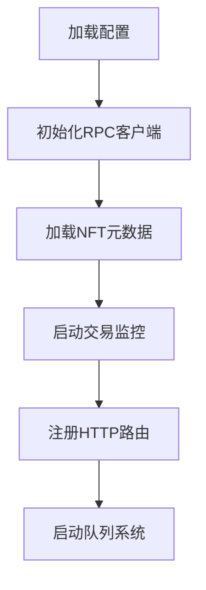

```markdown
# astro-orderx Go项目重构结构

## 目录结构
```bash
.
├── cmd
│   ├── monitor-server/      # 监控服务入口
│   └── api-server/         # API服务入口
├── internal
│   └── monitor              # 监控业务核心模块
│       ├── api             # HTTP接口层
│       │   └── handler.go  # 支付回调/交易查询等接口实现
│       ├── service         # 业务逻辑
│       │   ├── tx_monitor.go       # 交易监控（原monitorPay.js）
│       │   ├── nft_service.go      # NFT转移处理（原nftTransfer）
│       │   └── utxo_service.go     # UTXO管理（原operation.js）
│       ├── dao             # 数据访问
│       │   ├── rpc_client.go       # 区块链节点交互（原initRpc.js）
│       │   └── explorer_client.go  # 区块浏览器交互
│       ├── model
│       │   ├── dto         # 业务实体
│       │   │   ├── transaction.go  # 交易结构体
│       │   │   └── nft.go          # NFT元数据
│       │   └── po          # 持久化对象
│       │       └── utxo.go # UTXO存储结构
│       └── router
│           └── router.go   # 路由配置（原apiServer.js）
├── pkg
│   ├── dogecore           # Dogecoin核心库封装
│   │   ├── decoder.go      # 交易解码（原decodeElon.js）
│   │   └── script.go      # 脚本解析工具
│   └── utils
│       ├── converter       # 单位转换工具（原tool.js）
│       └── queue           # 交易队列（原slowSpeed/）
├── configs
│   ├── config.yaml         # 配置文件（原.env）
│   └── dogechain.go        # 链参数配置
├── go.mod
├── go.sum
└── docs
    └── api.md             # API文档
```

## 核心模块映射

### 1. 监控服务 (monitor/service)

```go
// tx_monitor.go
type BlockMonitor struct {
    rpcClient      *dogecore.RPCClient
    nftMap         sync.Map       // 替换原JS的Map
    taxRate        float64
    callbackURL    string
}

// 保持原JavaScript版的核心逻辑
func (m *BlockMonitor) ProcessTransaction(tx *model.Transaction) {
    // 实现地址支付检测逻辑（原AddressPay）
    // NFT状态更新逻辑（原nftTransfer）
}

// 实现双通道监控
func (m *BlockMonitor) StartDualMonitor(ctx context.Context) {
    go m.listenNodeWebsocket()  // 节点websocket监听
    go m.pollBlockExplorer()    // 区块浏览器轮询
}
```

### 2. RPC客户端 (pkg/dogecore)

```go
// rpc_client.go
type DogeClient struct {
    endpoint    string
    httpClient  *http.Client      // 带重试机制
    chainParams *chaincfg.Params  // 区块链网络参数
}

// 保持与JS版相同的UTXO获取逻辑
func (c *DogeClient) GetUTXOs(address string) ([]model.UTXO, error) {
    // 实现多页查询逻辑（原getutxoBypage）
}
```

### 3. 交易队列 (pkg/utils/queue)

```go
// tx_queue.go
type SlowQueue struct {
    jobs       chan *TransferJob  // 带缓冲通道实现队列
    rateLimit  time.Duration      // 15秒间隔控制
    rpcClient  *dogecore.RPCClient
}

// 保持原有速率控制逻辑
func (q *SlowQueue) StartWorker() {
    for job := range q.jobs {
        q.processTransfer(job)
        time.Sleep(q.rateLimit)
    }
}
```

## 监控服务初始化流程



## 关键优化点

1. **并发安全设计**

```go
// 使用sync.Map替代JS的Map
var nftUtxoMap sync.Map

func (m *BlockMonitor) UpdateNftUtxo(txHash string, nftID int) {
    nftUtxoMap.Store(txHash, nftID) 
}
```

2. **配置热加载**

```go
type MonitorConfig struct {
    CheckInterval  time.Duration `yaml:"check_interval"`
    TaxRate        float64       `yaml:"tax_rate"`
    BackupEndpoint string       `yaml:"backup_endpoint"`
}

func LoadConfig() (*MonitorConfig, error) {
    // 使用viper实现配置自动加载
}
```

3. **日志追踪增强**

```go
func LogTxFlow(tx *model.Transaction) {
    log.WithFields(log.Fields{
        "tx_hash": tx.Hash,
        "amount":  tx.Amount,
        "from":    tx.FromAddress,
        "to":      tx.ToAddress,
    }).Info("Transaction processed")
}
```

需要我继续展开哪个模块的具体实现细节？或是需要调整目录结构中的某些部分？

